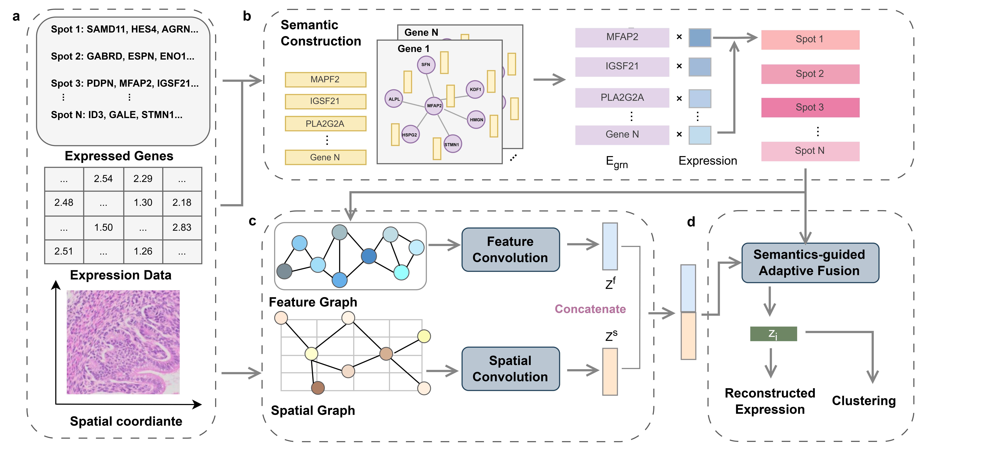

# Semantic-Guided Spatial Representation Learning for Spatial Domain Identification

[](https://www.python.org/)
[](https://pytorch.org/)
[](LICENSE)

## Overview

**GreS** is a novel graph-based deep learning framework that leverages **semantic embeddings** to modulate the learning of spatial domains. By integrating gene regulatory networks (GRNs) and large language model (LLM)-derived semantic knowledge, GreS enhances the representation of spatial spots, leading to more accurate clustering and domain identification.



Key features include:
*   🧠 **Semantic Knowledge Integration**: Utilizes semantic embeddings derived from LLMs and GRNs to guide representation learning.
*   🧬 **Dual Graph Encoding**: Captures both spatial dependencies (Spatial GCN) and functional gene relationships (Feature GCN).
*   🎯 **Adaptive Fusion**: Employs a gated fusion mechanism with FiLM (Feature-wise Linear Modulation) to dynamically weigh spatial vs. semantic information.
*   📉 **Robust Reconstruction**: Uses a ZINB decoder to handle sparsity and noise inherent in spatial transcriptomics data.

## Table of Contents

* [Installation](#installation)
* [Repository Structure](#repository-structure)
* [Data Preparation](#data-preparation)
* [Usage](#usage)
    *   [Preprocessing](#preprocessing)
    *   [Training](#training)
* [Output](#output)
* [Citation](#citation)
* [License](#license)

## Installation

### Option 1: Conda (Recommended)

```bash
# Create and activate environment
conda create -n gres python=3.9
conda activate gres

# Install PyTorch (adjust cuda version as needed)
conda install pytorch torchvision torchaudio pytorch-cuda=11.8 -c pytorch -c nvidia

# Install dependencies
pip install scanpy pandas numpy scipy scikit-learn matplotlib tqdm
```

## Repository Structure

```
GreS/
├── config/                 # Configuration files (e.g., DLPFC.ini)
├── data/
│   ├── raw_h5ad/           # Place your input .h5ad files here
│   ├── generated/          # Output of preprocessing (h5ad, graphs, etc.)
│   ├── npys_grn/           # Generated spot embeddings
│   └── result/             # Training results and logs
├── embeddings/             # Pretrained semantic embeddings and GRN networks
├── preprocess/             # Preprocessing scripts
├── fig/                    # Figure assets
├── models.py               # GreS model architecture
├── train.py                # Main training script
├── run_preprocess.sh       # Automated preprocessing pipeline
└── README.md
```

## Data Preparation

### 1. Prepare H5AD Files
Your spatial transcriptomics data should be in `.h5ad` format with:
*   `adata.X`: **Raw integer counts** of gene expression.
*   `adata.obsm['spatial']`: Spatial coordinates (x, y).
*   `adata.var_names`: Gene symbols.

### 2. Directory Setup
Place your raw `.h5ad` files in the `data/raw_h5ad/` directory. The filename (without extension) will be used as the `dataset_id`.

Example:
```bash
data/raw_h5ad/
├── 151507.h5ad
├── 151673.h5ad
└── E1S1.h5ad
```

## Usage

### Preprocessing

We provide a comprehensive shell script `run_preprocess.sh` that automates the entire preprocessing workflow: data cleaning, semantic embedding generation (GRN diffusion), spot embedding aggregation, and feature graph construction.

```bash
# Syntax: ./run_preprocess.sh <dataset_id> <config_name>

# Example 1: DLPFC dataset (using DLPFC config)
./run_preprocess.sh 151507 DLPFC

# Example 2: Embryo dataset (using Embryo config)
./run_preprocess.sh E1S1 Embryo
```

**Pipeline Steps:**
1.  **Data Preprocessing**: Filters genes/cells and normalizes data.
2.  **Semantic Embedding**: Generates semantic embeddings using GRN diffusion.
3.  **Spot Embedding**: Aggregates gene embeddings to the spot level.
4.  **Feature Graph**: Builds the feature adjacency graph based on spot embeddings.

### Training

Train the GreS model using `train.py`. The script supports both supervised (with ground truth labels) and unsupervised modes.

#### Basic Usage

```bash
python train.py \
    --dataset_id 151507 \
    --config_name DLPFC \
    --llm_emb_dir data/npys_grn/ \
    --run_name my_experiment
```

#### Key Arguments

| Argument | Description | Default |
| :--- | :--- | :--- |
| `--dataset_id` | Identifier for the dataset (must match preprocessing) | `Mouse_Brain_Anterior` |
| `--config_name` | Configuration file to use (e.g., `DLPFC`, `Embryo`) | Auto-inferred |
| `--use_llm` | Whether to use semantic embedding modulation (`true` or `false`) | `true` |
| `--n_clusters` | Force unsupervised mode by specifying cluster count manually | `None` |
| `--save_best_ckpt` | Save the model checkpoint with the best performance | `True` |
| `--run_name` | Sub-directory name for saving results | `default` |

## Output

Results are saved in `data/result/<config>/<dataset_id>/<run_name>/`:

*   **`best_cluster_outputs.npz`**: Contains final embeddings (`emb`), cluster labels (`idx`), and evaluation metrics.
*   **`metrics_best.json`**: JSON file summarizing the best performance metrics (ARI, NMI, etc.) and hyperparameters.
*   **`GreS.png`**: Visualization of the identified spatial domains.
*   **`checkpoints/`**: Saved model checkpoints (`.pt`).
*   **`train.log`**: Full training log.

## Citation

If you use GreS in your research, please cite:

```
(Coming Soon)
```

## License

This project is licensed under the MIT License - see the [LICENSE](LICENSE) file for details.
